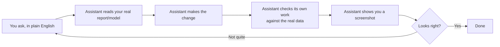

# New here? Start with this.

You don't need to know how to code to use anything in this repo. If words like "repo," "MCP,"
or "CLI" already feel like a wall, this page is for you — it explains everything in plain
language and gets you to a real first result before asking you to understand how it works.

## What is this, actually?

Imagine a very fast, very careful junior teammate who can open your actual Power BI report,
read the real numbers, make a change you ask for, and then double-check its own work against
the live data before showing you what changed — instead of just handing you some code and
hoping it's right.

That's what this is: an AI assistant with real, hands-on access to Power BI and Microsoft
Fabric. Not a chatbot that guesses. Something that can actually look, check, and show you proof.

## How it works, in one picture

The step most tools skip is D — checking the work against the real data before saying "done."
That's the difference between "it looks like it worked" and "it's actually correct."

## What you need before you start

1. **Power BI Desktop** — you probably already have this.
2. **An AI coding assistant** — a program you install once, then type plain-English requests
   into. A few options: Claude Code, GitHub Copilot CLI, or similar. If your organization
   already has one approved, use that.
3. **Microsoft's free skill pack for Fabric** — this teaches your assistant how to work with
   Power BI and Fabric specifically. Microsoft's own install guide walks through this step by
   step: [Install Skills for Fabric](https://learn.microsoft.com/en-us/fabric/fundamentals/skills-for-fabric-install).
   Follow that guide for the install itself — no need to repeat it here, and it'll always be
   more current than a copy would be.

Once those three things are in place, you're ready.

## Your first 10 minutes — a safe first try

Don't start by asking it to change anything. Start by asking it to just *look*:

> "Open my report and list every measure in the model, with a plain-English description of
> what each one does."

This only reads your model, it doesn't change anything, so there's nothing to undo if
something seems off. If you get a real, accurate answer back, you've confirmed the whole
chain actually works — your assistant, connected to your real report, giving you a real
answer. That's the moment it stops being theoretical.

## What to ask for next

Once the first try works, plain-English requests you can just... ask for:

- "Document this model — what tables, what do the relationships mean, what do the
  measures actually calculate."
- "Review this DAX measure and tell me if there's anything that will break or run slow."
- "My report navigation feels clunky — can you take a screenshot and suggest what to fix?"
- "Check this measure's logic against the actual data — does the number it returns match
  what a manual count would show?"

You never need to know the word "skill" or how any of this works internally to ask for these.
Just describe what you want, the way you'd ask a colleague.

## When to still bring in someone technical

This makes a BI person more capable — it doesn't replace needing a technical teammate
entirely. Bring one in for: the first-time install, anything touching a production dataset
real users depend on, and anything where you don't understand why it suggested a change. The
goal is more confidence doing more yourself, not doing everything alone.

## If you're the one deciding whether to let your team try this

Short version: this is Microsoft's own official tooling (free, Microsoft-maintained) plus a
small set of add-ons in this repo. Nothing here writes to a production report without a human
reviewing the result first — the whole point of the "checks its own work" step is that nothing
ships blind. The realistic payoff is a BI team that moves faster without needing to become
software engineers to do it.
