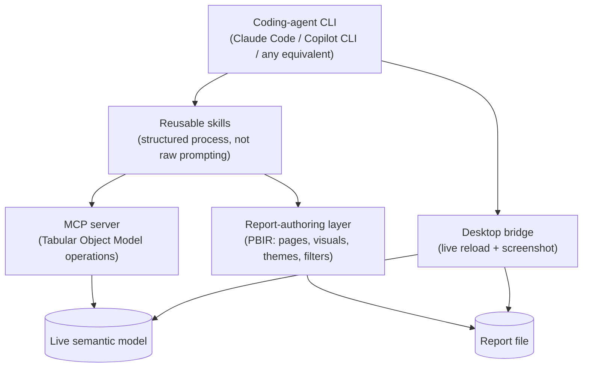
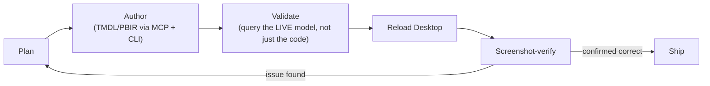

# Agentic Fabric + Power BI Dev Harness — Architecture (draft)

Prep material for Phase 3 of the personal-brand roadmap. Describes the *pattern*, not any
specific client's setup — no workspace names, connection strings, or data included anywhere
below. This is a starting draft, not a locked design; expect it to change once the actual repo
gets scoped.

## The core idea

Pair a coding agent (any CLI — Claude Code, GitHub Copilot CLI, Gemini CLI, or equivalent) with
structured, tool-level access to a Fabric/Power BI project, so it can author, validate, and ship
changes with the rigor a senior engineer would apply — not just generate DAX or M in a chat
window disconnected from the live model.

## The stack (generic components, all third-party/community tooling)

- **Coding-agent CLI** — the driver. Anything that can run shell commands, read/write files, and
  call MCP tools qualifies; the harness itself shouldn't assume one specific agent.
- **MCP server** — exposes Tabular Object Model operations against a live semantic model
  (tables, measures, relationships, DAX queries), so the agent edits/validates model objects
  directly instead of hand-writing TMDL blind.
- **Report-authoring layer** — PBIR (pages, visuals, themes, filters) as structured,
  hand-editable text, so report layout is also "code" an agent can work on.
- **Desktop bridge** — live reload + screenshot verification, the mechanism that turns "the
  agent wrote code" into "the agent confirmed it renders correctly."
- **Reusable skills** — structured process for repeatable tasks: model documentation, DAX
  authoring, deployment/TMDL export, diagnostics.

Open question for the actual build: does the public repo vendor/fork the MCP server and
skill implementations, or does it document the pattern and point to the existing third-party
tools to install separately? Leaning toward the latter for v0 (lower maintenance burden, gives
credit to the underlying tools) — revisit once repo scope is locked.

## The loop that makes it reliable, not just fast

The validate + screenshot-verify steps are the actual differentiator. A model or report edit
that looks correct in the file can still be wrong in ways only the live system reveals — a
subtle filter mismatch that silently changes which rows a measure counts, a pixel-level
alignment issue across pages, a theme color that only resolves wrong once actually rendered.
The discipline is: never call something "done" from reading the diff alone.

## What it's good for

- Documenting an undocumented model in minutes instead of days, by reading the live schema
  directly rather than reverse-engineering it from a report.
- Bulk-standardizing measures (format strings, descriptions, safe-division guards) across a
  whole model in one pass.
- Iterating report layout with actual visual proof at each step, not just "should look right."
- Catching data-integrity bugs before they ship — the kind that only show up when you query the
  live model instead of trusting a formula's apparent logic (e.g., a ranking measure that looks
  correct but silently includes rows with no valid underlying data).

## What it doesn't solve (be honest about this in the eventual README)

- Can't remote-control arbitrary window resizing/scrolling inside Desktop — screenshot
  verification is bounded by whatever fits in the current viewport.
- Doesn't replace modeling judgment — it verifies faster, it doesn't decide what the model
  *should* do.
- Still needs a human to review and ship; the loop shortens iteration, it doesn't remove
  the reviewer.

## Install prerequisites (generic, to firm up once repo scope is locked)

- Power BI Desktop (a build with Bridge/live-connection support)
- A coding-agent CLI of choice
- Node.js (most current MCP servers in this space run on it)
- The specific MCP server + skill packages — TBD per the "vendor vs. document" question above

## Status
Draft only, written 2026-07-04 as unblocked prep work while Phase 3's real prerequisite
(personal machine + IP-clause check) is still pending. Not yet reviewed against a real
decision on repo scope, licensing, or naming — treat as raw material, not a locked plan.
